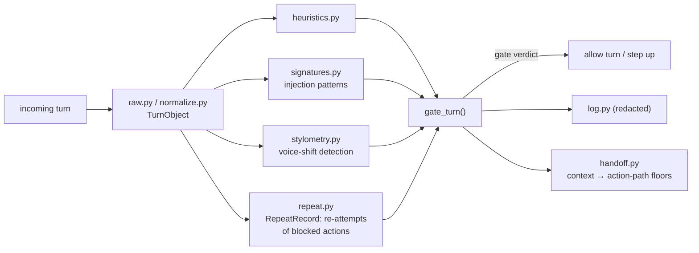

# Turn gate

The turn gate is Doberman's second chokepoint: it inspects the conversation turn (prompt plus
attached, pasted, or tool-fetched content) at a host pre-inference hook (code the host runs before
it calls the model), before a single inference token is spent. This page explains how it's built
and what it guarantees, alongside the action gate described in the [README](../README.md) that
inspects every tool call.

## How it fits together

The tool-call path is the safety guarantee: an attacker who evades the turn gate still meets it.
The turn gate is an efficiency and early-warning layer with a narrower promise: no Tier-0-signature
turn reaches the model. One engine backs both invocation points. `decide_turn` reuses the same
raise-only `combine` (it can only push a verdict stricter, never looser), the same `Decision` audit
model, and the same tiered-auth challenge as the action path. It adds no new verdict authority.
`turngate/` is a new adapter, a sibling to the MCP (Model Context Protocol) proxy. The engine itself
stays unchanged.

## The modules, under `src/doberman/turngate/`

- **`raw.py` + `normalize.py`** build a `TurnObject` from the host's pre-inference payload: the
  prompt text, any attached or pasted content, and tool-fetched material, normalized into one shape
  the rest of the gate can reason about.
- **`signatures.py`** is Tier 0: deterministic prompt-injection signatures (instruction
  nullification, authority-override attempts, secret-export phrasing, encoded payloads). This is
  the gate's only hard-stop tier, kept deliberately small.
- **`heuristics.py`** is Tier 1: broader heuristic recall for embedded agent-directed instructions,
  persona override, and urgency-plus-secrecy framing. AUTH-only; it can never BLOCK on its own.
- **`stylometry.py`** scores a per-entity prompt-style baseline (coarse buckets: length, word shape,
  punctuation and digit density; never raw text) and flags an extreme style outlier only when it
  co-occurs with sensitive apparent intent. It never escalates on style alone.
- **`repeat.py`** holds `RepeatRecord`, the state for re-attempts of a just-blocked turn.
  `register_block()` records a block, so a near-match resubmission gets a challenge scaled to the
  original block instead of a quiet reset.
- **`gate_turn()`** (in `hook.py`) is the single entry point. It builds the `TurnObject`, runs the
  guardrails above, combines their results with the same raise-only `combine` the action path uses,
  and enforces the outcome (release, challenge, or hold) before the turn reaches the model.
- **`log.py`** records the redacted verdict into the same local `decisions` table the action path
  uses, marked `action_type='turn'`, so one `doberman log` view covers both invocation points. A
  `TurnObject` carries no raw prompt text, so a logged row holds only fingerprints (irreversible
  stand-ins for the raw values), classes, and the verdict.
- **`handoff.py`** (`publish_turn_context`) passes a released turn's signals forward to the
  action-path floors. A flagged turn's stylometric p-value and heuristic tags become a bounded,
  non-negative contribution to that entity's next actions, and content tracing to a flagged pasted
  segment inherits `provenance: untrusted_data`.

## Invariants

- **Fail closed, same as the action path.** Any internal error in the gate becomes AUTH, never a
  silent pass.
- **Raise-only.** The gate can step up a turn; it can never whitelist a later action. A released
  turn's signals only ever add risk downstream, never subtract it.
- **Redaction holds.** Turn logging and the stylometric baseline never store or expose the prompt
  itself, only classes, fingerprints, and scores.
- **Graceful absence.** With no host pre-inference hook (a pure MCP-proxy deployment) or
  `DOBERMAN_TURN_GATE=off`, the gate is absent and the action gate carries everything.

## Known limits

BLOCK is reserved for the Tier 0 signature set. Everything merely suspicious asks the human instead.
Stylometry needs a matured per-entity baseline before it contributes anything. A shared account
blends typists, which degrades that signal toward noise. The turn gate does not catch every
injection: it narrows what reaches the model and hands the rest to the action gate.
